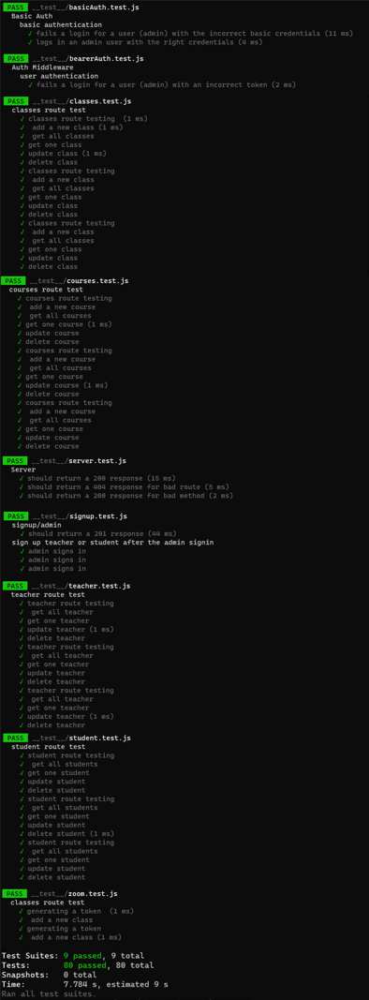

# The Error List

* Project Name: College-management-system

* Team Members:
  - Islam Attar
  - Ibrahim Oqoul
  - Bushra Dawdyeh
  - Nour Alsatari
  - Mujahed Abuarqob
  - Walid Alrefai

### Problem Domain
* This application will help colleges throughout the process of managing their institution. It brings together all aspects to achieve the mission of managing the entities in their institution: students, teachers, courses, and classes to improve the operational efficiency and manage the institution effectively. and this is what we are gonna do here by supporting the academic and administrative processes by minimizing the manual work

### Our Solution
* We solve this issue by transforming to a system that is web-based to minimize manual processes and maintain records in a database to track the information they need and save time and reduce staff workload. Our application keeps records of courses assigned to teachers, all students in a specific class.

### User Stories
* As a student, I want to be able to log in

* As a student, I want to choose the class i want

* As a student, I want to chat with my instructor in case i have questions

* As a student, I want to see all the classes i'm enrolled in

* As a teacher, I want to be able to log in

* As a teacher, I want to choose the course that i want to teach

* As a teacher, I want to see all the courses and the classes included that i'm teaching

* As a student/teacher, I want to get an email with credentials

* As an admin, I want to register students and teachers

* As an admin, I want to add courses, classes, and perform full CRUD operations on them

* As an admin, I want to see all the courses and their classes and who they are taught by

* As an admin I want to add students to a specific class

* As an admin I want to assign teachers to classes

### Endpoints documentation

    post("/signup/admin")
    Request:
    {
    "userName": "admin",
    "email": "admin@gmail.com",
    "password": "12345678",
    "role": "admin"
    }
    Response: application/json

    post("/signup/std-teacher")
    Request:
    {
        "userName": "student",
    "email": "student@gmail.com",
    "password": "12345678",
    "role": "student",
    "firstName": "student",
    "lastName": "student",
    "gender": "male",
    "nationality": "ionality",
    "major": "it"
    }
    Response: application/json

    post("/courses")
    Request:
    {
    "courseName": "javascript",
    "courseGrade": "100",
    }
    Response: application/json

    post("/classes")
    Request:
    {
    "className": "section1",
    "teacherId": "1",
    "courseId": "1",
    }
    Response: application/json
    post("/add-students-toClass/:id")
    Request:
    {
    "chosenStudent": "student"
    }
    Response: application/json
    post("/add-course-toTeacher/:id")
    Request:
    {
    "chosenCourse": "javascript"
    }
    Response: application/json

### ER diagram

### Tests

